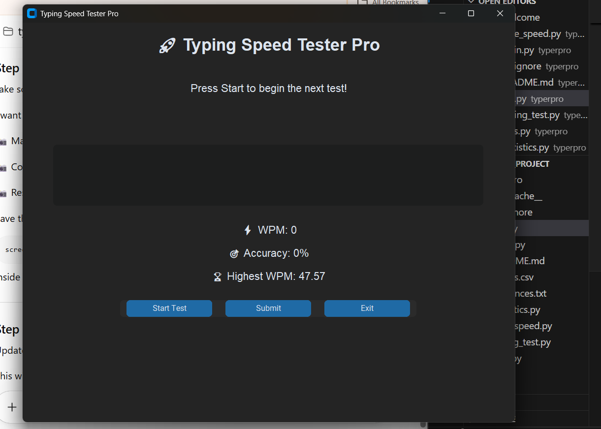
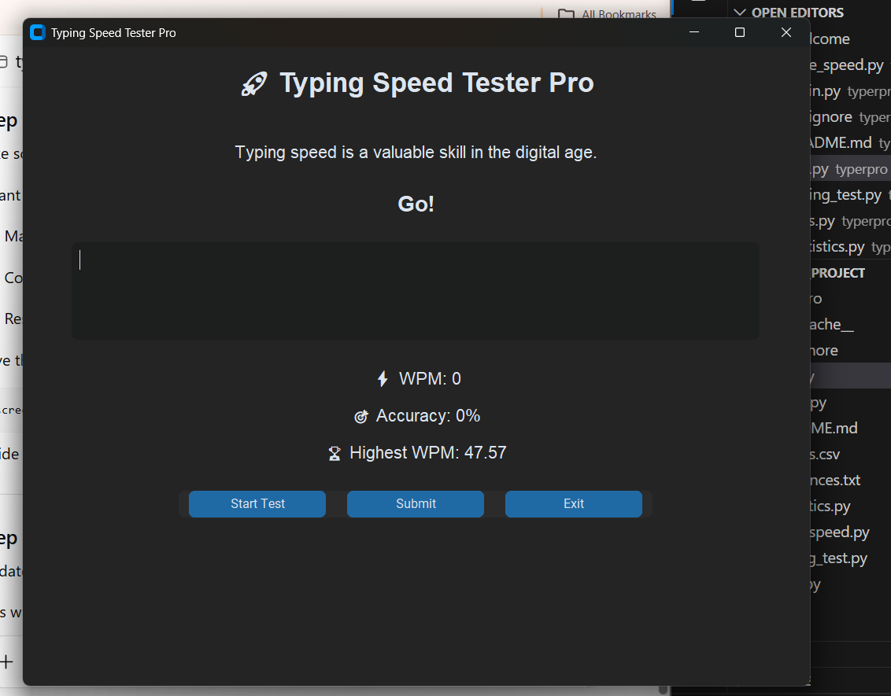
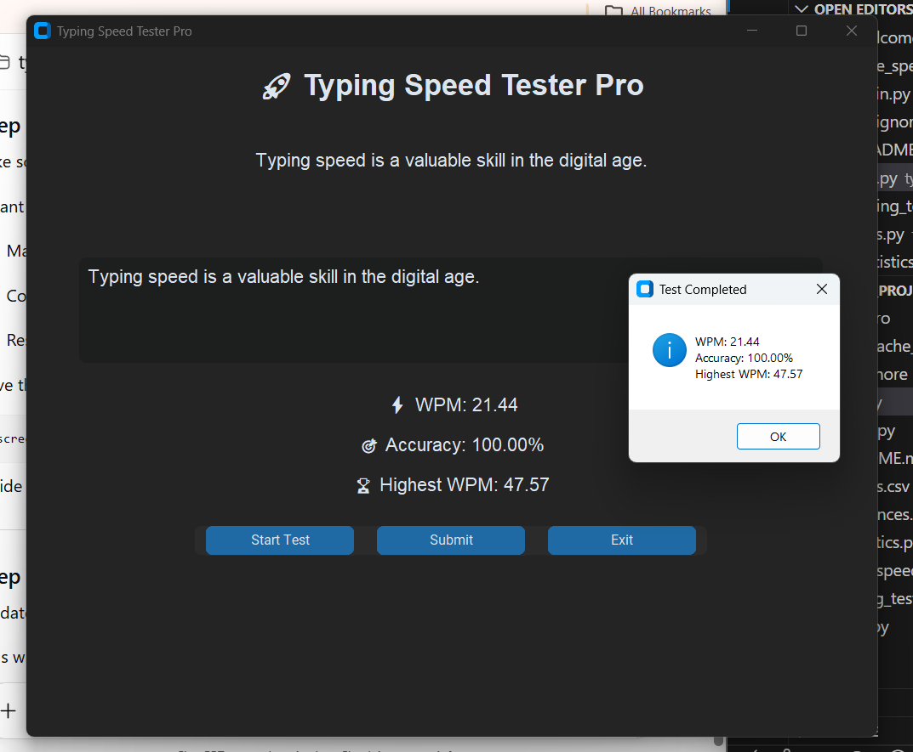

# Typing Speed Tester

A Python-based Typing Speed Tester that helps users measure their typing speed, accuracy, and performance across multiple rounds.

## Features

* Random typing prompts from a text file
* Countdown before typing starts
* Words Per Minute (WPM) calculation
* Accuracy calculation using `difflib`
* Correct and wrong word count
* Multiple rounds support
* Highest WPM tracking
* Score saving using CSV
* Statistics summary:

  * Games played
  * Highest WPM
  * Average WPM
  * Best accuracy
* Clean multi-file project structure
* Git and GitHub version control

## Technologies Used

* Python
* CSV module
* OS module
* Time module
* Random module
* Difflib module
* Git & GitHub

## Project Structure

```text
typing-speed-tester/
│
├── main.py
├── typing_test.py
├── statistics.py
├── utils.py
├── sentences.txt
├── .gitignore
└── README.md
```

## How to Run

1. Clone the repository:

```bash
git clone https://github.com/nidhi200623/typing-speed-tester.git
```

2. Open the project folder:

```bash
cd typing-speed-tester
```

3. Run the project:

```bash
python main.py
```

## What I Learned

Through this project, I learned how to:

* Structure a Python project into multiple files
* Use functions and imports effectively
* Read data from text files
* Save user scores into CSV files
* Calculate WPM, accuracy, and statistics
* Use Git and GitHub for version control
* Debug runtime issues and improve code quality

## Future Improvements

* Build a GUI using CustomTkinter
* Add user profiles
* Add typing history dashboard
* Add difficulty levels
* Add WPM graph
* Add SQLite database support
## Screenshots

### Main Interface


### Countdown


### Results Popup



## Author

**Satrasala Sreenidhi**
GitHub: [nidhi200623](https://github.com/nidhi200623)
